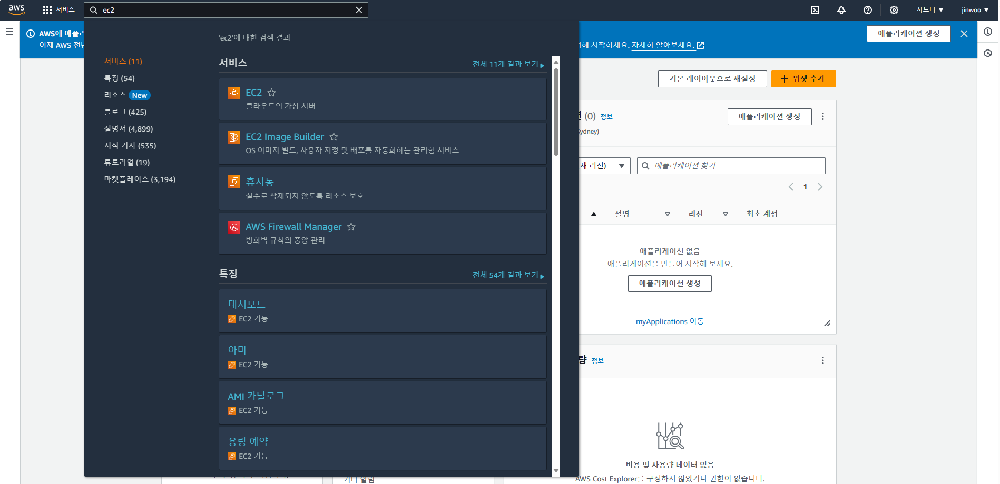
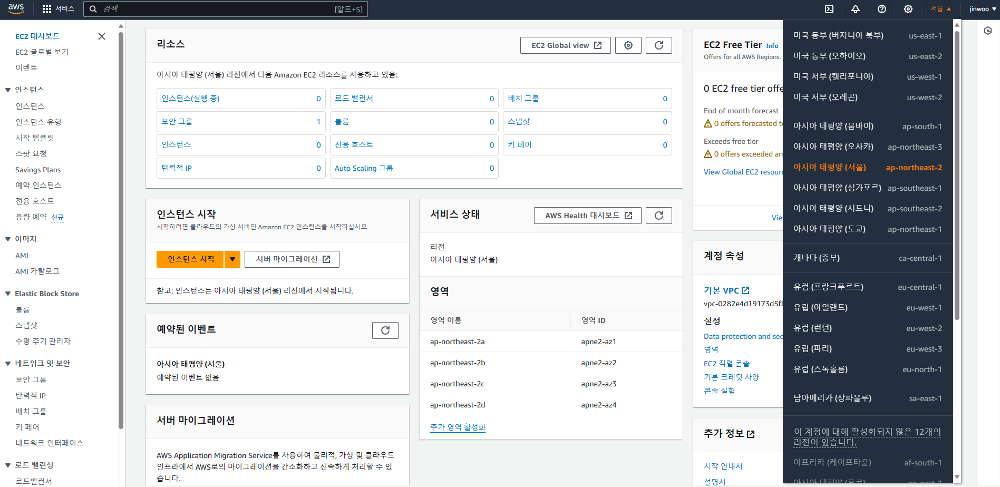
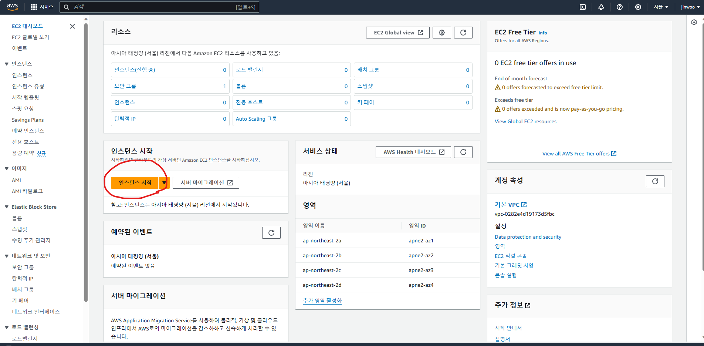
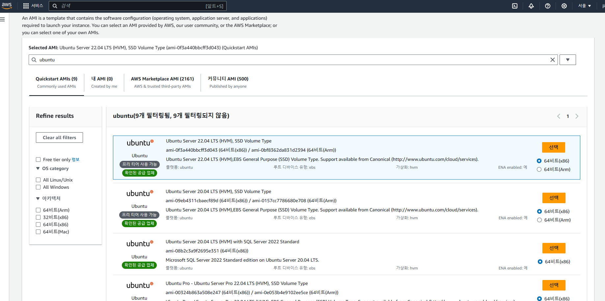
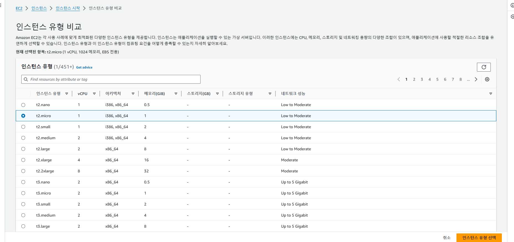
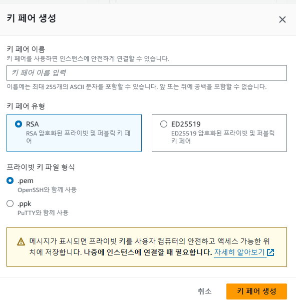
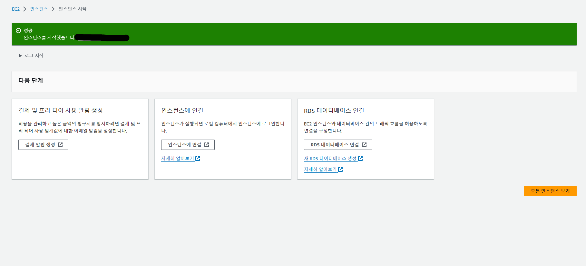

# 장고 AWS 배포

## 첫 배포
- 필요사항: github계정, AWS계정

### django 서비스
- 테스트 배포는 장고에서만 진행(serializers X)
- 프로젝트, 앱, 기본 index.html만 만들어 배포 확인
- github(deploy repo)

### AWS 회원가입 및 기본 설정
1. 회원가입 및 로그인
2. EC2서비스로 들어가기
  
3. 지역설정
  
4. 인스턴스 시작
  
5. AMI선택
  - Ubuntu Server 22.04 LTS 
  - 프리티어라고 표시된 유형이 사용자가 1년동안 일정 할당량 무료 이용가능
  - 
6. 인스턴스 유형 선택
  
7. 키페어 생성
  - .pem으로 만들기
  - 자동으로 .pem파일 생성
  - 
8. 인스턴스 시작
  

EC2란?

<!-- summary 아래 한칸 공백 두어야함 -->
[EC2설명](https://docs.aws.amazon.com/ko_kr/AWSEC2/latest/UserGuide/concepts.html)

#### reference
[AWS 홈페이지](https://aws.amazon.com/ko/console/)
[Django 서비스 AWS로 배포하기-네로](https://nerogarret.tistory.com/45)
[AWS로 django 서비스 배포하기 (Windows)](https://opheliesaysone.tistory.com/48)
[리눅스와 우분투](https://hanamon.kr/%EB%A6%AC%EB%88%85%EC%8A%A4%EB%8A%94-%EB%AC%B4%EC%97%87%EC%9D%B4%EA%B3%A0-%EC%9A%B0%EB%B6%84%ED%88%AC%EB%8A%94-%EB%AC%B4%EC%97%87%EC%9D%B8%EA%B0%80/)